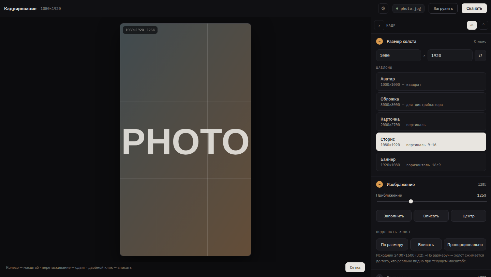

# Cropper

**English** · [Русский](README.ru.md)

A single-page image cropper for release artwork: pick a canvas size, frame the
photo, export at full resolution. No build step, no dependencies, no server —
open `index.html` in a browser and work offline.



## Quick start

```bash
git clone https://github.com/cs-eliseev/cropper.git
cd cropper
xdg-open index.html        # macOS: open index.html
```

That is the whole install. Then:

1. Drop an image onto the canvas (or click it to pick a file).
2. Choose a preset — cover, artist card, story, banner, avatar — or type your own size.
3. Drag to move, scroll to zoom, double click to fit.
4. Pick a format, check the quality note, press **Download**.

## What it does

- **Canvas presets** for the sizes distributors and platforms ask for, plus any custom size.
- **Real framing.** Drag and wheel work on the picture itself; the preview is
  scaled down but the export is always cut from the original file at full resolution.
- **Quality guard.** The panel tells you how many pixels of the original land in
  the frame and warns before an upscale turns the picture soft.
- **Fit the canvas to the image** — three ways: to the visible part, to the whole
  image, or proportionally to the current long side.
- **Rule-of-thirds grid** over the frame.
- **JPEG / PNG / WEBP** with an adjustable quality and an editable file name.
- **Languages and themes** — Russian and English included, your own are loaded
  as a file right in the interface (⚙ in the header) or kept next to `index.html`.

The panel remembers what you had open, the canvas size, the format, the
language and the theme between sessions (`localStorage`).

## Keyboard

| Key | Action |
| --- | --- |
| `0` | fit the whole image into the canvas |
| `1` | fill the canvas |
| double click | fit |

## Project layout

```
index.html                  markup and the load order of every file
config.js                   settings: language, theme, blocks, presets, formats
main.js                     composition root: settings → modules
css/app.css                 blocks and metrics — not a single colour, all tokens
themes/{dark,light}.css     themes: the full list of tokens
lang/{ru,en}.js             dictionaries
kernel/                     container, event bus, bootstrap
Core/Geometry/Frame/        framing maths — pure, no DOM
Core/Storage/{KeyValue,Files}/   ports to localStorage and to files
Modules/Canvas/Size/        canvas size
Modules/Image/Frame/        the frame: loading, zoom, position
Modules/Export/Save/        format, quality, saving the file
Modules/Shared/Panel/       the panel and its blocks
Modules/Shared/Preferences/ language and theme
scripts/arch-check.mjs      module boundary check
docs/                       screenshots
```

The CSS follows BEM: `block`, `block__element`, `block--modifier`. Every rule
starts with a class, so markup and styles can be read side by side.

## How the code is arranged

A modular monolith of vertical slices: each module is one business function
with its own data, actions and entry points.

- **Business logic lives in `Actions/`**: one class is one operation with a
  single public `run()`. An entry point (`Ui/Controllers/`) only builds a DTO
  and calls one action.
- **Modules never reach into each other.** Only `Contracts/`, `Events/`,
  `DTO/`, `VO/`, `Enums/` and `Exceptions/` are public. A synchronous call goes
  through a contract (this is how the frame asks the canvas to resize itself to
  the image); a notification goes through an event (this is how export learns
  the canvas changed and suggests a new file name).
- **Shared capability without entry points lives in `Core/`**: the framing
  maths and the storage ports. Core knows nothing about modules.
- **Storage only through a repository**, anything external only through a
  gateway. Each module writes its own key in `localStorage` and touches no other.
- **DTOs, VOs, events and exceptions are immutable** — frozen in the constructor.

The rules come from the `modular-monolith` skill; the deviations the browser
environment forced are listed in [AGENTS.md](AGENTS.md).

Boundaries are checked without a build step and without dependencies:

```bash
node scripts/arch-check.mjs
```

It catches reaching into another module's internals, a dependency pointing up
the layers, an action with two public methods, an unfrozen DTO and a file name
that does not match its role.

## Your own languages

The language is switched under ⚙ in the header, next to two buttons:

- **File…** — load your own dictionary from disk, `.json` or `.js`;
- **Template** — download the current dictionary to translate it.

The usual order: download the template, translate the strings, load it back.
The dictionary stays in the browser and is picked up on the next launch.

To have a language in the set from the start, drop the file into `lang/` and
add it to `index.html` next to the others:

```html
<script src="lang/es.js"></script>
```

A dictionary file is a single call:

```js
App.lang({
  code: 'es',
  name: 'Español',
  dir: 'ltr',                 // 'rtl' for Arabic or Hebrew
  strings: { appTitle: 'Recorte', load: 'Cargar', save: 'Descargar' }
});
```

The same object without the wrapper is valid `.json` for the ⚙ picker. Keys
your translation does not cover come from the fallback language
(`fallbackLang` in `config.js`), so a partial translation breaks nothing.

## Your own themes

A theme is a file of tokens and nothing else: `themes/dark.css` lists the
whole set with comments. The tokens are the same in Cropper and Clipper, so a
theme can be carried between them unchanged.

A file loaded through ⚙ → Theme → File… **layers over** the selected theme
instead of replacing it — overriding a few tokens is enough:

```css
:root {
  --acc: #2f7fbf;
  --bg: #eef2f6;
}
```

A theme meant to stay is easier to keep next to the page and declare in
`config.js`:

```js
App.theme({ id: 'sand', name: 'Sand', href: 'themes/sand.css' });
```

Markup and metrics live in `css/app.css`, which holds no colours at all. The
classes are BEM, so overriding a single block from your own file is easy too:
`.preset--on { … }`.

## Settings (config.js)

| Key | What it sets |
| --- | --- |
| `lang`, `fallbackLang` | language at first launch (`auto` follows the browser) and the fallback |
| `theme` | theme at first launch |
| `blocks.order`, `.hidden`, `.open` | order of the panel blocks, what to hide, what to open |
| `presets`, `preset` | canvas presets and the default one |
| `formats`, `quality` | export formats and JPEG/WEBP quality |
| `matte` | what fills the empty edges when exporting JPEG |
| `grid` | rule-of-thirds grid |
| `outNamePattern` | file name pattern, `{w}`, `{h}`, `{ext}` |
| `previewMax` | cap on the internal preview resolution |

The user always wins: language, theme and panel state stay in the browser.
**Reset mine** under ⚙ brings everything back to `config.js`.

## Tests

No dependencies, no `npm install` — everything runs on built-in tooling:

```bash
npm test          # 160 unit tests on the built-in node --test runner
npm run arch      # module boundary check
npm run smoke     # a run in a real browser
npm run check     # boundaries + tests
```

Tests live inside the modules, next to the code:

```
Core/Geometry/Frame/Tests/Unit/          framing maths
Core/Storage/KeyValue/Tests/             the storage contract and its implementations
Modules/<Module>/Tests/Unit/             pure logic
Modules/<Module>/Tests/Feature/          whole actions, on doubles
Modules/<Module>/Tests/Contracts/        contract tests of the public surface
Modules/<Module>/Tests/Doubles/          doubles published for other modules' tests
```

Three things this setup buys:

- **A loader instead of a build.** `scripts/test-loader.mjs` reads the script
  order straight from `index.html` and runs the files in one `node:vm` context —
  exactly what the browser does. The tests therefore exercise the same code that
  opens from disk, with no bundler and no `import`.
- **Contract tests.** A module publishes the test for its own contract, and both
  the real action and the double another module uses have to pass it. The canvas
  double used in the frame's tests is checked by the very same test as the
  original — otherwise a green test on a double would prove nothing.
- **The browser separately.** `npm run smoke` opens the page in a headless
  browser and walks the user's path: drop an image, pick a preset, zoom, fit the
  canvas, save the file, switch language and theme. That is what cannot be
  checked without a DOM.

## Browser support

Any current Chromium, Firefox or Safari. WEBP export needs a browser with
`canvas.toBlob('image/webp')` — Chromium and Firefox have it, Safari 17+ too.

## License

MIT — see [LICENSE](LICENSE).
